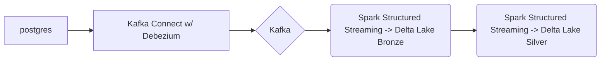

# lakehouse-poc

A Data Lakehouse Proof-of-Concept for streaming CDC events from a database into cloud storage using Delta Lake

## Overview



## Getting Started

Please make sure you have a Docker runtime installed and running.

1. `make scala-build`

    This will run `sbt assembly` and create your app jar inside the docker container

2. `make spark-build`

    Builds spark image with app jar from previous step.

3. `make up`

    Starts all services found in `docker-compose.yaml` in daemon mode. **NOTE:** `connect` service takes some time to start up (approx. 2-5 mins), so follow logs until Connect is ready to handle requests.

4. `make start-postgress-connector`

    Creates Debezium postgres connector in Kafka Connect, and starts an initial snapshot of postgres tables.

5. `make consume-messages`

    Starts the avro-console-consumer script from Schema Registry service, you can use this to verify messages are in Kafka and can be consumed. Use `ctrl+c` to exit.

## Creating Delta Lake Tables

To get started producing Delta Lake tables, run the following. You will need to wait for the Bronze Table to be created prior to running the Silver table process.

1. `make bronze` (in new terminal)

    Starts the Kafka -> Delta Table (Bronze layer) process

2. `make silver` (in new terminal)

    Starts the Delta Table (Bronze) -> Delta Table (Silver)

## Making Database Changes

Run `make login-postgres` to login to the db (or use a db client of your choice), and make changes to the `customers` table. Provided below is a starting point:

```sql
update customers set first_name = 'Jerry', last_name = 'Garcia' where id = 1002;
update customers set first_name = 'Jerry', last_name = 'Garcia' where id = 1003;
update customers set first_name = 'Jerry', last_name = 'Garcia' where id = 1004;
```

## Viewing the Delta Tables

### S3/MinIO

Visit <http://localhost:9001> to access the MinIO console, using `minioadmin/minioadmin` un/pw to log in and view the Delta Lake Objects.

### Spark Shell

Run `make spark-shell` in another terminal window to start a spark shell, and use the following code to see create the bronze and silver DataFrames.

#### Viewing the DataFrames

```scala
// set delta locations
val deltaBronzePath = "s3a://warehouse/bronze/inventory/customers"
val deltaSilverPath = "s3a://warehouse/silver/inventory/customers"

// create dataframes
val bronzeDf = spark.read.format("delta").load(deltaBronzePath)
val silverDf = spark.read.format("delta").load(deltaSilverPath)

// display dataframes
bronzeDf.sort(asc("_cdc_meta_source_ts_ms")).show(false)
silverDf.sort(asc("_cdc_meta_source_ts_ms")).show(false)
```

#### Using Delta Lake Time Travel

Using Spark SQL below, we can select versions of the Delta Lake tables

```scala
// describe history of delta table
spark.sql(s"DESCRIBE HISTORY delta.`${deltaSilverPath}`").show()

// show delta table from a specific version
spark.sql(s"select * from delta.`${deltaSilverPath}` VERSION AS OF 1").show(false)

// show delta table from a specific timestamp
spark.sql(s"select * from delta.`${deltaSilverPath}` TIMESTAMP AS OF 'yyyy-MM-dd HH:mm'").show(false)
```
